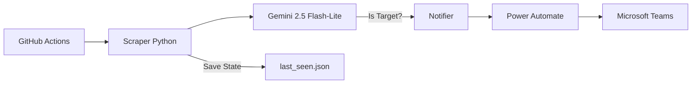

# 🏗️ Blueprint: Sistema de Monitoramento com IA (Custo Zero)

Este guia consolida a experiência de construção do **Alerta de Editais**, servindo como um manual de "copia e cola" para replicar a infraestrutura de monitoramento inteligente, filtragem por IA e notificação no Microsoft Teams.

---

## 📅 1. Arquitetura Funcional (O Fluxo)



---

## 🛠️ Phase 1: Setup do Microsoft Teams (Power Automate)

Este foi o ponto mais crítico do projeto original. Para funcionar sem erros de permissão corporativa:

1.  **Criar o Fluxo:** No Teams, abra o app **Workflows** (Fluxos de Trabalho).
2.  **Modelo:** Escolha *"Postar em um chat quando uma solicitação de webhook for recebida"*.
3.  **Configuração de Identidade (PULO DO GATO):**
    *   No editor do fluxo, altere o campo **"Postar como"** de `Flow bot` para **`Usuário`**.
    *   Isso evita falhas de localização de thread e garante que a mensagem seja entregue.
    *   Selecione o **Chat** (Grupo ou Individual) de destino.
4.  **Configuração do Card Adaptável:**
    *   Não aponte o campo diretamente para o corpo do webhook.
    *   Use a seguinte **Expressão** no campo de entrada do cartão:
        ```
        first(variables('Attachments'))?['content']
        ```
5.  **Webhook URL:** Salve a URL gerada (você a usará no segredo `TEAMS_WEBHOOK_URL` do GitHub).

---

## 🧠 Phase 2: Setup do Cérebro (Google Gemini)

Para manter o custo zero e alta disponibilidade:

1.  **Acesso:** Gere sua chave em [aistudio.google.com](https://aistudio.google.com/).
2.  **Modelo Escolhido:** Use obrigatoriamente o **`gemini-2.5-flash-lite`**.
    *   **Por que?** Ele oferece **1.000 requisições/dia** no plano grátis. A versão padrão (`flash`) limita a apenas 20/dia, o que trava o bot na primeira execução.
3.  **SDK:** Instale o pacote moderno: `pip install google-genai`.

---

## 🐍 Phase 3: Lógica Core (Snippets Reutilizáveis)

### 3.1 O Filtro Inteligente (`ai_filter.py`)
Use este template para garantir que a IA retorne apenas JSON, facilitando o processamento posterior.

```python
from google import genai
import json

def filter_content(title, text):
    client = genai.Client(api_key="SUA_CHAVE")
    model_id = 'gemini-2.5-flash-lite'
    
    prompt = f"Analise: {title} - {text}. Responda APENAS JSON: {{'is_target': true/false, 'reason': '...'}}"
    
    response = client.models.generate_content(model=model_id, contents=prompt)
    
    # Limpeza de Markdown (Remover ```json ...)
    clean_json = response.text.replace("```json", "").replace("```", "").strip()
    return json.loads(clean_json)
```

### 3.2 O Notificador com Adaptive Card (`notifier.py`)
O Teams exige um "envelope" específico para que o Power Automate entenda o cartão direto.

```python
import requests

def send_to_teams(webhook_url, card_content):
    payload = {
        "type": "message",
        "attachments": [{
            "contentType": "application/vnd.microsoft.card.adaptive",
            "content": card_content # Objeto JSON do Adaptive Card
        }]
    }
    requests.post(webhook_url, json=payload)
```

---

## 🚀 Phase 4: Automação (GitHub Actions)

O arquivo `.github/workflows/monitor.yml` precisa gerenciar a persistência para não repetir alertas.

### Configurações Vitais:
1.  **Permissões de Escrita:**
    Vá em **Settings → Actions → General → Workflow permissions** e marque **"Read and write permissions"**. Sem isso, o bot não consegue salvar o arquivo `last_seen.json`.
    
2.  **Cron Schedule (Fuso Horário):**
    O GitHub usa UTC. Para rodar às 08:00 BRT, use `0 11 * * *`.
    
3.  **Persistência Simples:**
    Sempre adicione um passo final no YAML para comitar as mudanças:
    ```yaml
    - name: Commit and Push changes
      run: |
        git config --global user.name "bot"
        git config --global user.email "bot@action.com"
        git add data/last_seen.json
        git commit -m "Update state" || exit 0
        git push
    ```

---

## ⚠️ Checklist de Troubleshooting (O que aprendemos)

*   **Geo-Blocking:** O GitHub roda em IPs dos EUA. Se o site alvo sumir com conteúdos nacionais, use o `Referer` nos Headers e tente acessar as categorias diretas (ex: `/noticias/`) em vez da Home.
*   **Rate Limits:** O Gemini Free aceita apenas 5 requisições por minuto. Adicione um `time.sleep(15)` entre o processamento de cada notícia no seu loop principal.
*   **Empty Paragraphs:** No Scraper, use seletores em cascata (try/except ou múltiplos XPaths) para garantir que você pegue o resumo, caso o layout do site mude.
*   **Adaptive Cards:** Teste seu design no [Adaptive Cards Designer](https://adaptivecards.io/designer/) antes de codificar. Use sempre a versão **1.4** para máxima compatibilidade com o Teams Mobile.

---

> [!TIP]
> **Dica de Ouro:** Guarde sempre o `last_seen.json` no repositório. Ele age como seu "banco de dados" gratuito e infinito, garantindo que o bot saiba exatamente o que já foi notificado mesmo após o servidor do GitHub ser resetado.
